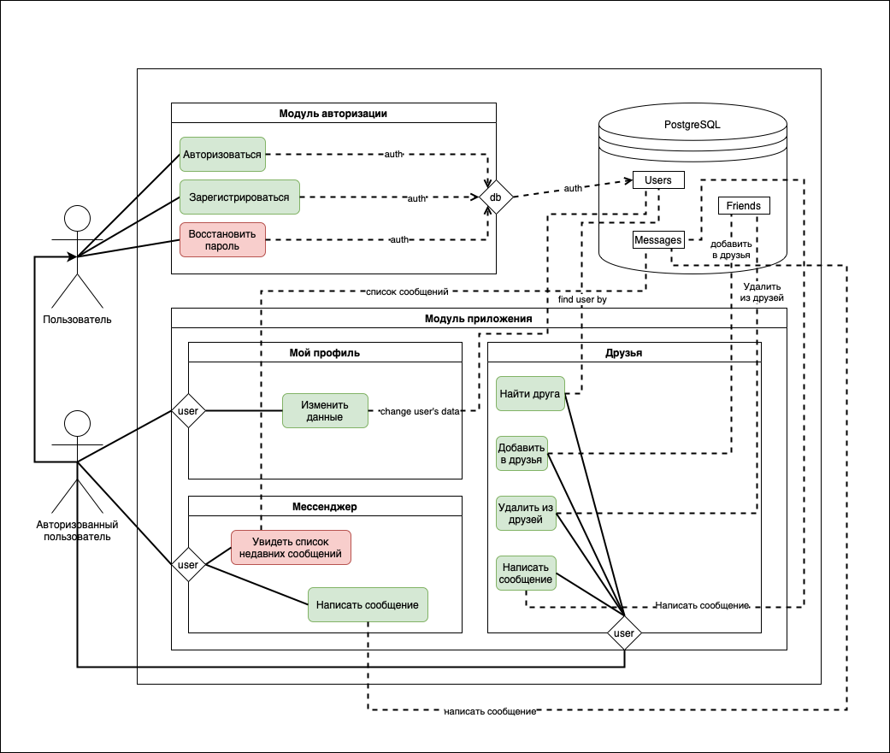

# Техническое задание

## Стек технологий

| Технология | Задача | Причина использования |
|------------|--------|-----------------------|
| VueJS | Реализовать веб интерфейс приложения | С данным фреймворком мне уже приходилось работать при написании лабораторных работ. В ходе работы с VueJS я оценил его простоту использования и довольно большой функционал, что идеально для не профессионального Frontend-разработчика. |
| Kotlin | Язык для Backend части | Java - язык, который я знаю лучше чем любой другой, а Kotlin, можно сказать, что Java "на стероидах". Его использование обусловлено более простым синтаксисом, в частности по отношению к null-safety. |
| Spring Framework | Бизнесс логика приложения | "Фреймворк фреймвоков". Идеален практически для любого JVM-приложения. Очень облегчает написание кода. Опыт работы с фреймворком также есть. |
| Spring Boot | Бизнесс логика приложения | Для упрощения работы со Spring |
| Spring MVC | WEB взаимодействие | Очень удобеный фреймворк для обработки WEB-запросов |
| Spring Data | Взаимодествие с БД | Удобство. Краткость кода. Безопасность (Hibernate под капотом) |

## Use Case

## Архитектура 

### База данных

#### Users

| Имя атрибута | Ограничения | Обязательность | Тип данных | Описание |
|--------------|-------------|----------------|------------|----------|
| id | Unique | Да | integer | id обьекта |
| login | Unique, length > 0 | Да | varchar(40) | Логин пользователя |
| password | length > 0 | Да | bytea | Пароль пользователя |
| salt |  | Да | bytea | Соль для хеширования пароля |
| name | length > 0 | Да | varchar(40) | Имя пользователя |
| surname | length > 0 | Да | varchar(40) | Фамилия пользователя |
| birthday |  | Да | Date | Год рождения пользователя |

#### Friends

| Имя атрибута | Ограничения | Обязательность | Тип данных | Описание |
|--------------|-------------|----------------|------------|----------|
| userid | | Да | integer | id пользователя |
| friendid | | Да | integer | id друга |

#### Requests

| Имя атрибута | Ограничения | Обязательность | Тип данных | Описание |
|--------------|-------------|----------------|------------|----------|
| userid | | Да | integer | id пользователя |
| friendid | | Да | integer | id друга |

#### Messages

| Имя атрибута | Ограничения | Обязательность | Тип данных | Описание |
|--------------|-------------|----------------|------------|----------|
| userid | | Да | integer | id пользователя |
| friendid | | Да | integer | id друга |
| text | length > 0 | Да | varchar(500) | Текст сообщения |
| time |  | Да | timestamp with time zone | Время и дата отправки сообщения |

## Frontend

Задачи нацелены на создание интерфейса взаимодействия с пользователем

| Задание | Дедлайн | Текущий статус | Описание | Свзанные задания |
|---------|---------|----------------|----------|------------------|
| Приложение должно быть написано на VueJS| 04.04.2022 | Выполнено | | |
| Разработать дизайн | 30.03.2022 | Выполнено | Сайт должен иметь 2 страницы: <ul><li>Стартовая страница с авторизацией</li><li>Страница с основной информацией</li></ul> | <ul><li>- [x] Start page</li><li>- [x] Main page</li></ul> |
| Стартовая страница | 29.03.2022 | Выполнено |<ul><li>- [x] На стартовой странице должно быть окно регистрации / авторизации </li><li>- [ ] Если останется время реализовать сброс пароля и регистрацию через google </li></ul> | |
| Главная страница | 31.03.2022 | Выполнено | На главной странице должно быть 3 раздела: <ul><li>Профиль - страница с данными пользователя. Должна быть возможность изменять свои данные</li><li>Друзья - страница с возможностью поиска других пользователей</li><li>Сообщения - страница с сообщениями от других пользователей</li></ul> | <ul><li>- [x] My profile</li><li>- [x] Friends</li><li>- [x] Messenger</li></ul> |
| Мой профиль | 30.03.2022 | Выполнено | Обязательные поля: <ul><li>- [x] Имя</li><li>- [x] Дата рождения</li><li>- [x] Логин</li><li>- [x] Пароль</li></ul> | |
| Друзья | 30.03.2022 | Выполнено | Должен быть реализован поиск по имени и нику, у пользователя должно показываться когда он в последний раз был в сети, должна быть кнопка "Добавить в друзья", должна быть возможность удалять пользователей из друзей, должна быть возможность писать сообщения пользователям | |
| Сообщения | 31.03.2022 | Выполнено | Для каждого пользователя хранить всю переписку с каждым пользователем, отображать ее, должно быть поле ввода сообщения и кнопка отправки его || 

## Backend

Задачи нацелены на реализацию логики приложения

| Задание | Дедлайн | Текущий статус | Описание | Свзанные задания |
|---------|---------|----------------|----------|------------------|
| Основная логика приложения должна быть написана на Kotlin с использованием Spring Boot | 04.04.2022 | Не начато | | |
| Написать модель данных| 01.04.2022 | Выполнено | Сущности, репозитории, сервисы, контроллеры, мапперы, врапперы | <ul><li>- [x] Необходимо составить архитектуру приложения</li></ul>|
| Основная логика | 02.04.2022 | Выполнено | Приложение должно быть разбито на 2 модуля: <ul><li>- [x] Аунтификация</li><li>- [x] Работа с пользователем (друзья и сообщения)</li></ul> | <ul><li>- [x] Auth </li><li>- [x] Main logic </li></ul> |
| Тесты | 04.04.2022 | В процессе | Напистать Unit и итеграционные тесты | |

